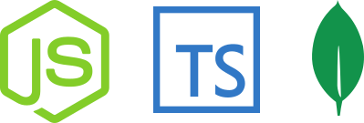

<h1 align="center">
    
</h1>

## 💻 Project summary

This is a template for Node.js projects using Typescript and MongoDB in a development environment

## 🛠 Technologies

Project was built using **Node.js**, **Typescript**, **MongoDB** and the following dependencies:

- **[Nodemon](https://www.npmjs.com/package/nodemon)** - Is a tool that helps develop node.js based applications by automatically restarting the node application when file changes in the directory are detected.

- **[Sucrase](https://www.npmjs.com/package/sucrase)** - Is an alternative to Babel that allows super-fast development builds. Instead of compiling a large range of JS features to be able to work in Internet Explorer, Sucrase assumes that you're developing with a recent browser or recent Node.js version, so it focuses on compiling non-standard language extensions: JSX, TypeScript, and Flow. Because of this smaller scope, Sucrase can get away with an architecture that is much more performant but less extensible and maintainable.

- **[Cors](https://www.npmjs.com/package/cors)** - Is a node.js package for providing a Connect/Express middleware that can be used to enable CORS with various options.

- **[dotenv](https://www.npmjs.com/package/dotenv)** - Is a zero-dependency module that loads environment variables from a .env file into process.env. Storing configuration in the environment separate from code is based on The Twelve-Factor App methodology.

- **[Express](https://www.npmjs.com/package/express)** - Fast, unopinionated, minimalist web framework for node.

- **[Mongoose](https://www.npmjs.com/package/mongoose)** - Is a MongoDB object modeling tool designed to work in an asynchronous environment. Mongoose supports both promises and callbacks.

## 🔨 Local Installation

You need [Node.js](https://nodejs.org) version 10 or higher, but if you want to use [Yarn](https://yarnpkg.com/) you can also just have it on your computer to continue.

```bash
git clone https://github.com/jhonywalkeer/typescript-node.git

$ cd first-api
$ npm install or yarn install
```

Configure the `.env.example` file correctly and then run our api locally by running the following command:

```bash
$ cd typescript-node
$ npm dev or yarn dev
```

## 📖 License

This project is under license from MIT. See the [LICENSE](LICENSE.md) file for more details.
